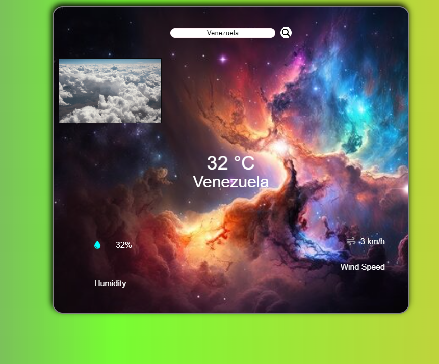

# Weather App

The Weather App is a React-based web application designed to provide users with live weather information for any country or city worldwide. By simply entering the name of the desired location into the search bar, users can access real-time data on temperature, wind speed, and humidity.

## Features

- **Live Weather Data:** Retrieve real-time weather information.
- **Search Functionality:** Enter the name of a country or city to get weather details.
- **User-friendly Interface:** Intuitive design for seamless navigation.

## Technologies Used

- **React**
- **HTML**
- **CSS**
- **JavaScript**
- **OpenWeatherMap API**

## Usage

1. Clone the repository to your local machine.
2. Install dependencies using `npm install`.
3. Start the app with `npm start`.
4. Access the app in your browser at [http://localhost:3000](http://localhost:3000).
5. Enter the name of the desired country or city into the search bar.
6. Press Enter or click the search icon to retrieve weather information.

## Note

You don't need to obtain your own API key from OpenWeatherMap. The application already includes a key for accessing weather data.

## Screenshots

## Future Improvements

- **Additional Weather Details:** Expand the app to include more comprehensive weather information.
- **Geolocation Integration:** Implement geolocation to automatically detect user location.
- **Responsive Design:** Optimize the app for various screen sizes and devices.

## License

This project is licensed under the MIT License. See the LICENSE file for details.

## Acknowledgements

- Weather icons by Font Awesome
- Weather data provided by OpenWeatherMap API

## Live Demo

[View Live](weatherappbyaziz.netlify.app)
